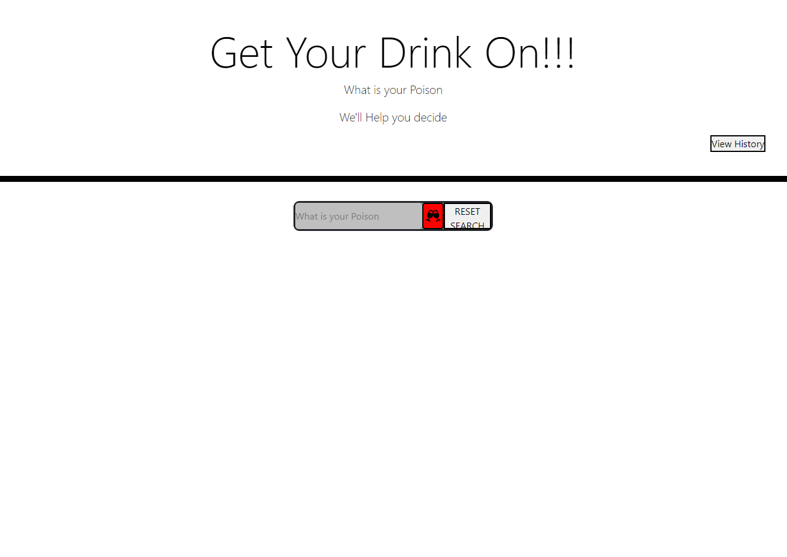
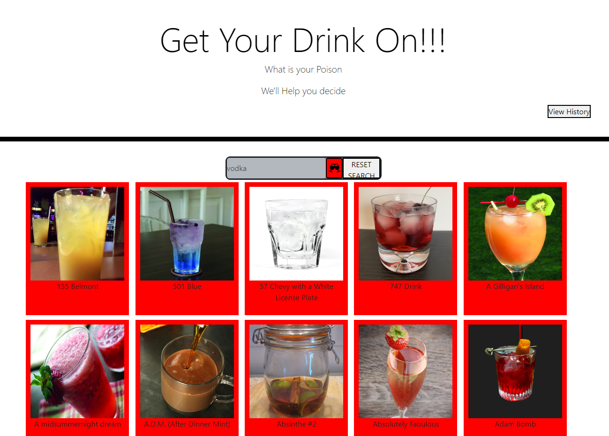
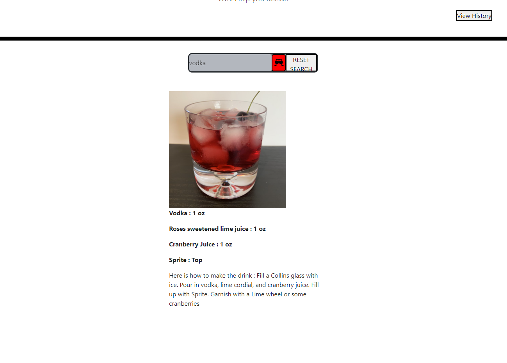
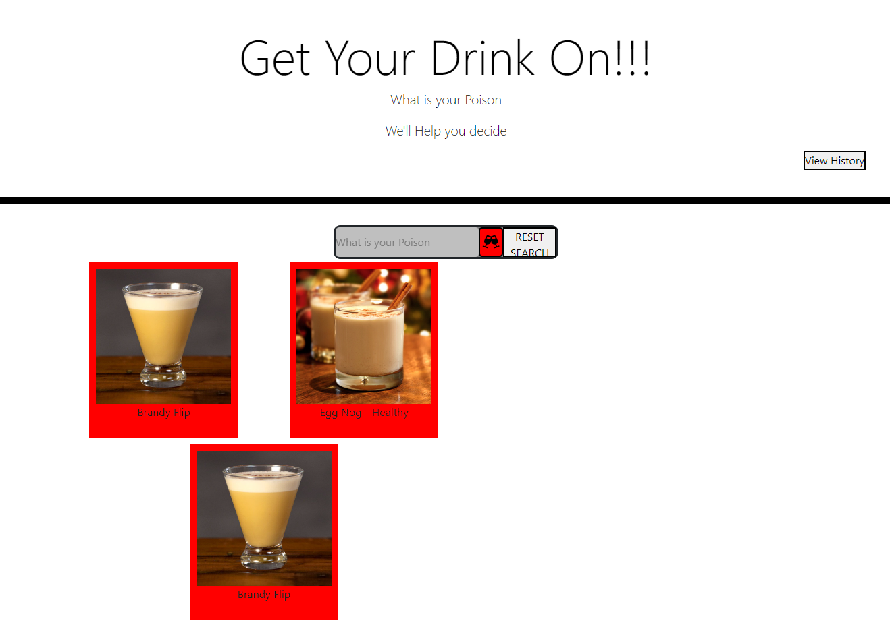

# GetYourDrinkON!
Project 1

## Description

Provide a short description explaining the what, why, and how of your project. Use the following questions as a guide:

- What was your motivation?
- Why did you build this project? (Note: the answer is not "Because it was a homework assignment.")
- What problem does it solve?
- What did you learn?

We wanted to create an application to help with the creation of mixed drinks. It can be difficult to remember favorite recipes, or what can be made with what ingredients are at hand. This application allows a user to input what ingredient they would like to use. They are then given a list of drinks, with thumbnails, that use the searched ingredient. Once a drink is selected the full recipe will be shown. 

## Installation

*PlaceholderURL*

## Usage

Once the the page, input into the search bar what ingredient you would like to search recipes for.

After pressing the search button a list of recipes will appear. The user will then select a drink from the list or search a different ingredient in the search bar.

Once a drink is selected by clicking the full recipe will appear.

At any point a user can click the "View History" button to pull up all recipes that have been previously selected.

## Credits

Collaborators:

Armaan Zabihi https://github.com/ArmaanZabihi
Kaz Nyborg-Andersen https://github.com/kaznyborg
Ranjit Saini https://github.com/rjsaini88
Rudy Yamashiro https://github.com/RudezY

Third-Party Assets:
API: The Cocktail Database https://www.thecocktaildb.com/api.php